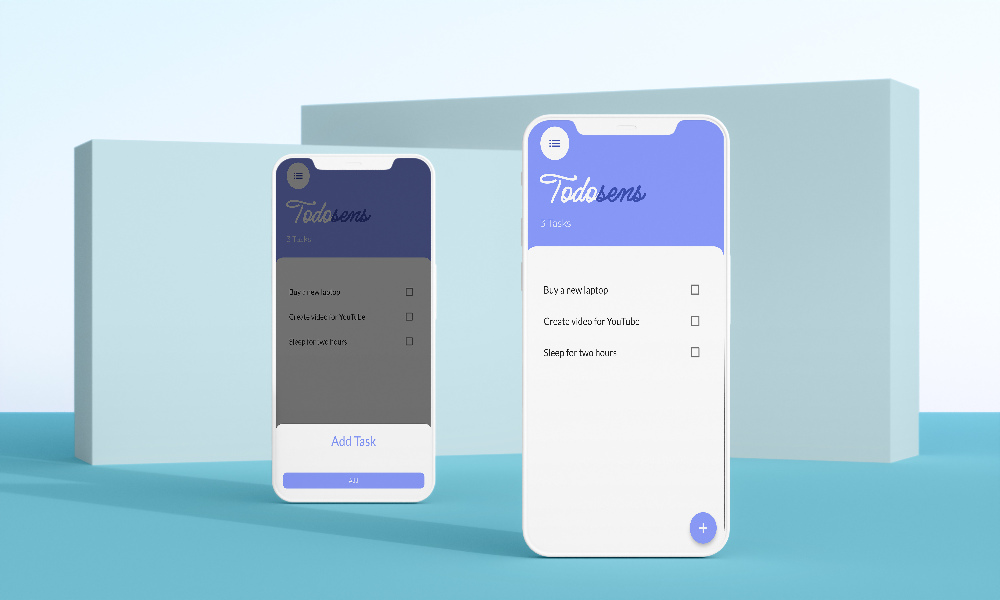

<a name="readme-top"></a>
<div align="center">

  
  

  <h1>Todosens App</h1>
  
  <p>
    An Todo App that allows you to add, remove and mark tasks!
  </p>

  
<!-- Badges -->
<p>
  <a href="https://github.com/ladunjexa/Todosens-App/graphs/contributors">
    
  </a>
  <a href="">
    
  </a>
  <a href="https://github.com/ladunjexa/Todosens-App/network/members">
    
  </a>
  <a href="https://github.com/ladunjexa/Todosens-App/stargazers">
    
  </a>
  <a href="https://github.com/ladunjexa/Todosens-App/issues/">
    
  </a>
  <a href="https://github.com/ladunjexa/Todosens-App/blob/master/LICENSE">
    
  </a>
</p>
   
 <h4>
    <a href="https://github.com/ladunjexa/Todosens-App/">View Demo</a>
  <span> · </span>
    <a href="https://github.com/ladunjexa/Todosens-App">Documentation</a>
  <span> · </span>
    <a href="https://github.com/ladunjexa/Todosens-App/issues/">Report Bug</a>
  <span> · </span>
    <a href="https://github.com/ladunjexa/Todosens-App/issues/">Request Feature</a>
  </h4>
</div>

<br />

<!-- Table of Contents -->
<details>

<summary>

# :notebook_with_decorative_cover: Table of Contents

</summary>

- [About the Project](#star2-about-the-project)
  * [Folder Structure](#bangbang-folder-structure)
  * [Tech Stack](#space_invader-tech-stack)
- [Getting Started](#toolbox-getting-started)
  * [Installation](#gear-installation)
  * [Run Locally](#running-run-locally)
- [Contributing](#wave-contributing)
- [License](#warning-license)
- [Contact](#handshake-contact)
- [Acknowledgements](#gem-acknowledgements)

</details>  

<!-- About the Project -->
## :star2: About the Project

<div align="center"> 
  
  <!--  -->
</div>
<br />

Todo App that allows to add, remove and mark tasks, using Flutter with custom-widgets ⚖

<!-- Folder Structure -->
### :bangbang: Folder Structure

Here is the code folder structure.
```
bmicalc/
|- fonts
|- images
|- lib/
  |-- models/
  |-- screens/
  |-- widgets/
  |-- main.dart
```

Now, lets dive into the lib folder which has the main code for the application.

#### models

`task.dart` - Modeling `task` class for the purpose of creating instances of tasks according to desired fields and constructor.

#### screens (activities)

`tasks_screen.dart` - This code implementing the UI (User Interface) of the task list screen, where the user view and manage the user's task list. Take a look of this activity at [About The Project](#star2-about-the-project) section.

`add_task_screen.dart` - This code implementing the UI (User Interface) of the add task screen, where the user add new tasks. Take a look at this activity at [About The Project](#star2-about-the-project) section.

#### widgets (components)

`task_list.dart` - `task_tile.dart`

This folder houses all the components listed above which they are custom flutter widgets with beautiful customized theme.

<br />

<!-- TechStack -->
### :space_invader: Tech Stack


<p align="right">(<a href="#readme-top">back to top</a>)</p>

<!-- Getting Started -->
## 	:toolbox: Getting Started

<!-- Installation -->
### :gear: Installation

#### Step 1:
Download or clone this repo by using the link below:

```bash
 https://github.com/ladunjexa/Todosens-App
```

#### Step 2:

Go to project root and execute the following command in console to get the required dependencies:

```bash
  flutter pub get
```

<!-- Run Locally -->
### :running: Run Locally

Clone the project

```bash
  git clone https://github.com/ladunjexa/Todosens-App
```

Go to the project directory

```bash
  cd Todosens-App
```

Install dependencies

```bash
  flutter pub get
```

Start the application

```bash
  flutter run
```

<p align="right">(<a href="#readme-top">back to top</a>)</p>

<!-- Contributing -->
## :wave: Contributing

<a href="https://github.com/ladunjexa/Todosens-App/graphs/contributors">
  
</a>


Contributions are always welcome!

See [`contributing.md`](https://contributing.md/) for ways to get started.

Contributions are what make the open source community such an amazing place to learn, inspire, and create. Any contributions you make are **greatly appreciated**.

If you have a suggestion that would make this better, please fork the repo and create a pull request. You can also simply open an issue with the tag "enhancement".
Don't forget to give the project a star! Thanks again!

1. Fork the Project
2. Create your Feature Branch (`git checkout -b feature/AmazingFeature`)
3. Commit your Changes (`git commit -m 'Add some AmazingFeature'`)
4. Push to the Branch (`git push origin feature/AmazingFeature`)
5. Open a Pull Request

<p align="right">(<a href="#readme-top">back to top</a>)</p>

<!-- License -->
## :warning: License

Distributed under the MIT License. See [LICENSE.txt](https://github.com/ladunjexa/Todosens-App/blob/main/LICENSE) for more information.

<p align="right">(<a href="#readme-top">back to top</a>)</p>

<!-- Contact -->
## :handshake: Contact

Liron Abutbul - [@lironabutbul6](https://twitter.com/lironabutbul6) - [@ladunjexa](https://t.me/ladunjexa)

Project Link: [https://github.com/ladunjexa/Todosens-App](https://github.com/ladunjexa/Todosens-App)

<p align="right">(<a href="#readme-top">back to top</a>)</p>

<!-- Acknowledgments -->
## :gem: Acknowledgements

This section used to mention useful resources and libraries that used in Todosens App project.

 - [Google Fonts](https://fonts.google.com/)
 - #FlutterBrew

<p align="right">(<a href="#readme-top">back to top</a>)</p>
