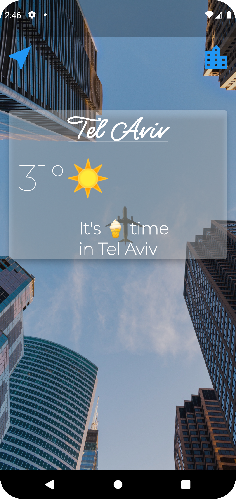

<a name="readme-top"></a>
<div align="center">

  
  

  <h1>Weatrio App</h1>
  
  <p>
    An Weather App to check the weather around the world! 
  </p>

  
<!-- Badges -->
<p>
  <a href="https://github.com/ladunjexa/weatrio-app/graphs/contributors">
    
  </a>
  <a href="">
    
  </a>
  <a href="https://github.com/ladunjexa/weatrio-app/network/members">
    
  </a>
  <a href="https://github.com/ladunjexa/weatrio-app/stargazers">
    
  </a>
  <a href="https://github.com/ladunjexa/weatrio-app/issues/">
    
  </a>
  <a href="https://github.com/ladunjexa/weatrio-app/blob/master/LICENSE">
    
  </a>
</p>
   
 <h4>
    <a href="https://github.com/ladunjexa/weatrio-app/">View Demo</a>
  <span> · </span>
    <a href="https://github.com/ladunjexa/weatrio-app">Documentation</a>
  <span> · </span>
    <a href="https://github.com/ladunjexa/weatrio-app/issues/">Report Bug</a>
  <span> · </span>
    <a href="https://github.com/ladunjexa/weatrio-app/issues/">Request Feature</a>
  </h4>
</div>

<br />

<!-- Table of Contents -->
<details>

<summary>

# :notebook_with_decorative_cover: Table of Contents

</summary>

- [About the Project](#star2-about-the-project)
  * [Folder Structure](#bangbang-folder-structure)
  * [Tech Stack](#space_invader-tech-stack)
- [Getting Started](#toolbox-getting-started)
  * [Installation](#gear-installation)
  * [Run Locally](#running-run-locally)
- [Usage](#eyes-usage)
- [Contributing](#wave-contributing)
- [License](#warning-license)
- [Contact](#handshake-contact)
- [Acknowledgements](#gem-acknowledgements)

</details>  

<!-- About the Project -->
## :star2: About the Project

<div align="center"> 
  
  
</div>
<br />
"Weatrio App" is an Weather Application that allows you to check the weather in different cities around the world.

<!-- Folder Structure -->
### :bangbang: Folder Structure

Here is the code folder structure.
```
weatrio/
|- android
|- ios
|- build
|- lib/
  |-- screens
  |-- serivces
  |-- utilities
|- fonts
|- images
```

Now, lets dive into the lib folder which has the main code for the application.

#### utilities

`constants.dart` - All the application level constants. Specifically, this constants.dart file contains theme classes for app widgets.

#### services

`location.dart` - This code implementing the ``Location`` class in order to get current location with Geolocator.

`networking.dart` - This code implementing the ``Network Helper`` class in order to communicate with OpenWeatherMap API using http protocol and decoding the data which written in json format.

`weather.dart` - This code implementing the ``WeatherModel`` class in order to retreive weather data from OpenWeatherMap API and modify conditional information according to the data.

#### screens (activities)

`city_screen.dart` - This code is the welcome screen, where the user need to provide city name. Take a look at the screenshot of this activity at the top.

`loading_screen.dart` - This code is the loading screen, kind of splash screen that runs until the necessary weather data is received.

`location_screen.dart` - This code is the location screen, where all the weather data in the requested city is displayed to the user. Take a look at the screenshot of this activity at the top.
<br />

<!-- TechStack -->
### :space_invader: Tech Stack


<p align="right">(<a href="#readme-top">back to top</a>)</p>

<!-- Getting Started -->
## 	:toolbox: Getting Started

<!-- Prerequisites -->
### :gear: Installation

#### Step 1:
Download or clone this repo by using the link below:

```bash
 https://github.com/ladunjexa/weatrio-app
```

#### Step 2:

Go to project root and execute the following command in console to get the required dependencies:

```bash
  flutter pub get
```

<!-- Run Locally -->
### :running: Run Locally

Clone the project

```bash
  git clone https://github.com/ladunjexa/weatrio-app
```

Go to the project directory

```bash
  cd weatrio-app
```

Install dependencies

```bash
  flutter pub get
```

Start the application

```bash
  flutter run
```

<p align="right">(<a href="#readme-top">back to top</a>)</p>

<!-- Usage -->
## :eyes: Usage

"Weatrio App" rely on an external dependencies and services like OpenWeatherMap API and Geolocator.<br/>
Therefore, in order for the application to work correctly, you will need to obtain a **free API Key** at https://openweathermap.org/<br/>

After you get your free API key, look for `weather.dart` which located in `lib/services/`.<br/>
Search for the following line, and replace the string with your new API key.

```javascript
const apiKey = 'INSERT-YOUR-API-KEY-HERE';
```

<p align="right">(<a href="#readme-top">back to top</a>)</p>

<!-- Contributing -->
## :wave: Contributing

<a href="https://github.com/ladunjexa/weatrio-app/graphs/contributors">
  
</a>


Contributions are always welcome!

See [`contributing.md`](https://contributing.md/) for ways to get started.

Contributions are what make the open source community such an amazing place to learn, inspire, and create. Any contributions you make are **greatly appreciated**.

If you have a suggestion that would make this better, please fork the repo and create a pull request. You can also simply open an issue with the tag "enhancement".
Don't forget to give the project a star! Thanks again!

1. Fork the Project
2. Create your Feature Branch (`git checkout -b feature/AmazingFeature`)
3. Commit your Changes (`git commit -m 'Add some AmazingFeature'`)
4. Push to the Branch (`git push origin feature/AmazingFeature`)
5. Open a Pull Request

<p align="right">(<a href="#readme-top">back to top</a>)</p>

<!-- License -->
## :warning: License

Distributed under the MIT License. See [LICENSE.txt](https://github.com/ladunjexa/Weatrio-App/blob/main/LICENSE) for more information.

<p align="right">(<a href="#readme-top">back to top</a>)</p>

<!-- Contact -->
## :handshake: Contact

Liron Abutbul - [@lironabutbul6](https://twitter.com/lironabutbul6) - [@ladunjexa](https://t.me/ladunjexa)

Project Link: [https://github.com/ladunjexa/weatrio-app](https://github.com/ladunjexa/weatrio-app)

<p align="right">(<a href="#readme-top">back to top</a>)</p>

<!-- Acknowledgments -->
## :gem: Acknowledgements

This section used to mention useful resources and libraries that used in Weatrio App project.

 - [OpenWeatherMap](https://openweathermap.org/)
 - [Geolocator](https://pub.dev/packages/geolocator)
 - [HTTP](https://pub.dev/packages/http)
 - [Flutter Spinkit](https://pub.dev/packages/flutter_spinkit)

<p align="right">(<a href="#readme-top">back to top</a>)</p>
